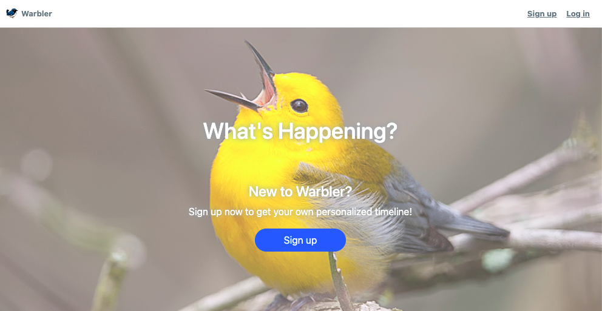
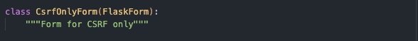
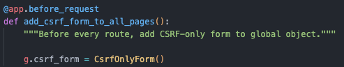
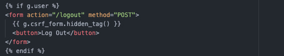

# Warbler

Warbler is a full-stack Twitter clone application. Users can create an account, search for and follow/unfollow other users, like/dislike messages from other users, and perform CRUD operations on their own messages. Authorization is required to access the main contents of the app.

View working demo [here](https://warbler-demo-050822.herokuapp.com/).

### Technologies
- Python
- Flask & Flask-SQLAlchemy & Flask-WTF
- Jinja
- Bcrypt
- Unitest

_This application was created for an exercise as part of the curriculum by [Rithm School](https://www.rithmschool.com/). Pair programmed with [Anita Lee](https://github.com/anita-lee)._

## Available Routes

- /
- /login
- /signup
- /users
- /users/profile
- /users/:user_id
- /users/:user_id/following
- /users/:user_id/followers
- /users/:user_id/liked-messages
- /messages/new
- /messages/:message_id

## Code snippet on CSRF protection

1) Create an empty CSRF form using Flask-WTF

2) Save CSRF form to global object

3) Add CSRF form to Jinja HTML template for all post requests

